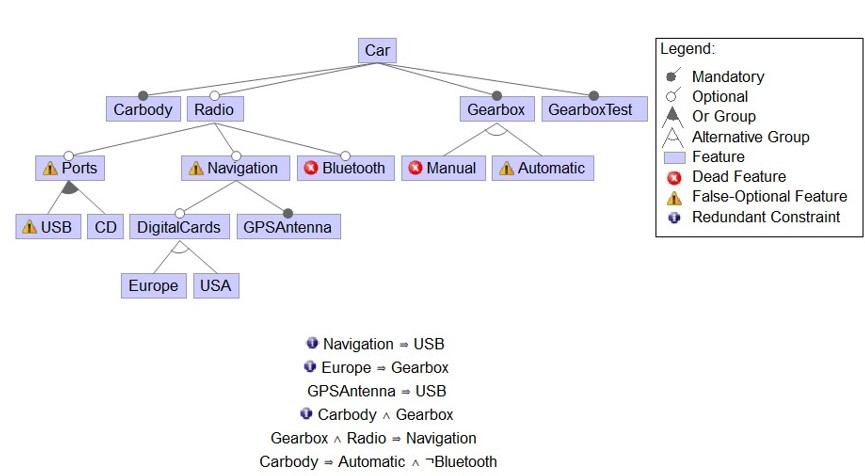

# FeatJAR-examples
This is the example project for [FeatJAR](https://github.com/FeatureIDE). It contains a collection of exemplary applications of the FeatJAR framework. 
Both the handling of the library directly and the use of the command line interface are described.  

__________
# Table of Contents
1. [Pre-Knowledge](#pre-knowledge)
2. [First Steps](#first-steps)
3. [Usage of Library direct ](#usage-of-library-direct)
4. [Usage with commandline ](#usage-with-commandline)
__________

## Pre-Knowledge
This tutorial explains how to use the FeatJAR library. For this purpose, an overview of the intended application possibilities is first given. 

### Objects
- Feature Model
    - Propositional Formula
    - CNF
    - DDNNF
    - BDD
- Configuration
- Feature
- Implementation artifact

### Functions
#### Feature Model

- Load Feature Model
    - Parameters: Format, Preprocessing
- Store Feature Model
    - Parameters: Format
- Analyze Feature Model
    - Void
        - Parameters: partial configuration, temp constraints
    - Number of configurations
        - Parameters: partial configuration, temp constraints
    - Core/Dead
        - Parameters: feature selection, partial configuration, temp constraints
    - Atomic Sets
        - Parameters: feature selection, partial configuration, temp constraints
    - False Optional
        - Parameters: feature selection, partial configuration, temp constraints
    - Indeterminate Hidden
        - Parameters: feature selection, partial configuration, temp constraints
    - Redundant Constraints
        - Parameters: feature selection, partial configuration, temp constraints
    - Explanations
- Convert Feature Model
    - Propositional Formula
    - CNF
        - Parameters: transformation (distributive, tseytin, ...)
    - DDNNF
        - Parameters: properties
    - BDD
        - Parameters: properties
- Modify Feature Model
    - Add/Remove Features
    - Add/Remove constraints
    - Slice Feature Model
    - Project feature model
    - Decomposition
    - Composition
- Diff Feature Models

#### Configuration
- Load Configuration
- Store Configuration
- Generate Configurations
    - Manual
    - Random configuration
    - Update partial configuration (decision propagation)
    - Complete partial configuration
- Analyze Configurations
    - Valid
    - Complete
    - Selected/deselected ratio
    - Coverage

#### Samples
- Load Configuration List
- Store Configuration List
- Generate samples
    - Random
    - T-Wise
- Analyse Samples
    - Coverage
    - Selected/deselected ratio
    - Distribution

#### Implementation Artifacts
- Analyze implementation artifacts
__________
## First Steps
### Requirements
+ IDE of your choice for example [Intellij](https://www.jetbrains.com/idea/) or [Eclipse](https://www.eclipse.org/)
+ Version Control System [GIT](https://git-scm.com/)
+ Build-Tool [GRADLE](https://gradle.org/)
+ Java Version 14   
### Load FeatJAR root project and build
### On Ubuntu
Run the following in shell:
```
sudo apt update
git clone https://github.com/FeatureIDE/FeatJAR.git && cd FeatJAR
```
#### Clone Script which loads necessary modules via git 
```
scripts/clone.bat
```
#### Build project
```
./gradlew build
```
__________
### On Windows

```
git clone https://github.com/FeatureIDE/FeatJAR.git && cd FeatJAR
```
#### Clone Script which loads necessary modules via git
```
scripts\clone.bat
gradlew build
```
#### Build project
```
gradlew build
```
For further information look at [FeatJAR](https://github.com/FeatureIDE/FeatJAR)
__________
## Usage of Library direct 
#### load feature model from xml 
```
File file = new File(SimpleExample.class.getClassLoader().getResource("featuremodels/car.xml").getPath();
Formula formula = CommandLineInterface.loadFile(file.getPath(), extensionManager.getExtensionPoint(FormulaFormats.class).get()).orElseThrow();
```
#### Transform formula into boolean representation for further calculations
```
var booleanRepresentation =
            async(formula)
            .map(ComputeNNFFormula::new)
            .map(ComputeCNFFormula::new)
            .map(ComputeBooleanRepresentation.OfFormula::new);
```
#### Get boolean clause list from boolean representation
```
var booleanClauseList = getKey(booleanRepresentation);
```
#### Create HasSolution analyse with boolean clause list
```
var hasSolutionAnalyze = new AnalyzeHasSolutionSAT4J().setInput(booleanClauseList);
```
#### Compute result of analyze
```
System.out.println(hasSolutionAnalyze.compute().get().get());
```
#### Check if feature model is void -> negate the result of hasSolutionAnalyze
```
System.out.println(!hasSolutionAnalyze.compute().get().get());
```

### Example for CoreDeadAnalysis
```
// get variableMap from booleanRepresentation for CoreDeadAnalyze
var variableMap = getValue(booleanRepresentation);
create CoreDeadAnalyze
var result = new AnalyzeCoreDeadVariablesSAT4J().setInput(booleanClauseList);
//  parse result
Computation<ValueAssignment> assignmentComputation = async(result, variableMap).map(ComputeValueRepresentation.OfAssignment::new);
// compute result and print
System.out.println(assignmentComputation.compute().get().get().print());
```

__________
## Usage with commandline 
After building the project, some output jar files are generated.
You can use the jar in the following direction`cli/build/libs/cli-*-all.jar` direct as library via a command line interface. 

### parameters for cmd
#### General options: 
1. `--help`: prints the usage of the information
2. `-- version`: prints the version information 
3. `-- verbosity <value>`: The logger verbosity, one of none, error, info, debug, progress (default: INFO)

Usage: ` java -jar feat.jar <command> [--<flag> | --<option> <value>]...`

available commands:
* `FormatConverter`: Queries SAT4J for all core and dead variables of a given formula, if any
* `AnalyzeCoreDeadVariablesSAT4J`: Queries SAT4J for the number of solutions of a given formula, if any
* `AnalyzeCountSolutionsSAT4J`: Queries SAT4J for the number of solutions of a given formula, if any
* `AnalyzeGetSolutionSAT4J`: Queries SAT4J for a solution of a given formula, if any
* `AnalyzeGetSolutionsSAT4J`: Queries SAT4J for all solutions of a given formula, if any
* `AnalyzeHasSolutionSAT4J`: Queries SAT4J for whether a given formula has a solution


### count feature model solutions
```
java -jar cli/build/libs/cli-*-all.jar --command countsharpsat --input cli/src/test/resources/testFeatureModels/car.xml
java -jar cli/build/libs/cli-*-all.jar --command isvoid --input cli/src/test/resources/testFeatureModels/car.xml
java -jar cli/build/libs/cli-*-all.jar --command coredead --input cli/src/test/resources/testFeatureModels/car.xml
```

### or, equivalently, using Gradle
```
./gradlew :cli:run --args " --command countsharpsat --input src/test/resources/testFeatureModels/car.xml"
```